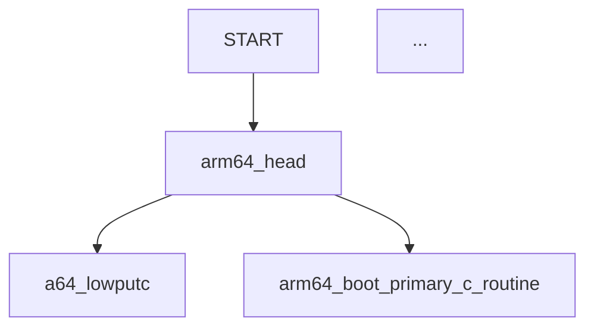
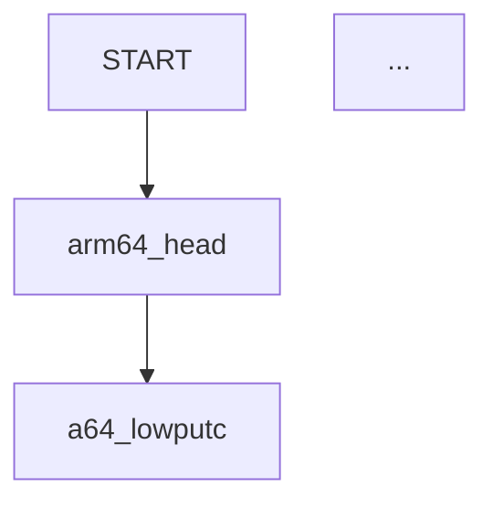

# (Clickable) Call Graph for Apache NuttX Real-Time Operating System

📝 _10 Mar 2023_


[_Clickable Call Graph for Apache NuttX RTOS_](https://github.com/lupyuen/pinephone-emulator#call-graph-for-apache-nuttx-rtos)

Last week we ran [__Apache NuttX Real-Time Operating System__](https://lupyuen.github.io/articles/what) (RTOS) on [__Unicorn Emulator__](https://www.unicorn-engine.org/)...

-   [__"(Possibly) Emulate PinePhone with Unicorn Emulator"__](https://lupyuen.github.io/articles/unicorn)

And we hit a baffling [__Arm64 Exception__](https://lupyuen.github.io/articles/unicorn#emulator-halts-with-mmu-fault) in the (Emulated) __Memory Management Unit__.

In this article we'll create some tools  to __troubleshoot the Arm64 Exception__ in NuttX...

-   Render the [__Dynamic Call Graph__](https://en.wikipedia.org/wiki/Call_graph) for Apache NuttX RTOS, to understand how it boots (pic above)

-   [__Make it Clickable__](https://github.com/lupyuen/pinephone-emulator#call-graph-for-apache-nuttx-rtos), so we can browse the __NuttX Source Code__ as we explore the Call Graph

-   We'll use a __Block Execution Hook__ in Unicorn Emulator to generate the Call Graph with Rust

-   And call the Rust Libraries [__addr2line__](https://crates.io/crates/addr2line) and [__gimli__](https://crates.io/crates/gimli) to map the Code Addresses to NuttX Kernel Functions

-   Thanks to the (Clickable) Call Graph, we'll describe the complete __Boot Sequence__ of NuttX RTOS on [__Pine64 PinePhone__](https://wiki.pine64.org/index.php/PinePhone)

-   And explain how we might do __Automated Daily Build and Test__ for NuttX on PinePhone

CPU Emulators (like Unicorn) can be super helpful for understanding the internals of __complex embedded programs__... Like Apache NuttX RTOS!

Let's dive in and learn how...


[_Running Apache NuttX RTOS in Unicorn_](https://lupyuen.github.io/articles/unicorn#apache-nuttx-rtos-in-unicorn)

# Intercept Code Execution in Unicorn

_What's Unicorn? How does it work with Apache NuttX RTOS?_

[__Unicorn__](https://www.unicorn-engine.org/) is a lightweight __CPU Emulator Framework__ based on [__QEMU Emulator__](http://www.qemu.org/).

In the [__last article__](https://lupyuen.github.io/articles/unicorn) we called Unicorn (in Rust) to run the __Arm64 Machine Code__ for Apache NuttX RTOS...

```rust
// Arm64 Machine Code for Apache NuttX RTOS
let arm64_code = include_bytes!("../nuttx/nuttx.bin");

// Init Unicorn Emulator in Arm64 mode
let mut unicorn = Unicorn::new(
  Arch::ARM64,
  Mode::LITTLE_ENDIAN
).expect("failed to init Unicorn");

// Magical horse mutates to bird
let emu = &mut unicorn;

// Omitted: Map Executable Memory and I/O Memory in Unicorn
...

// Boot NuttX RTOS in Unicorn Emulator
let err = emu.emu_start(
  0x4008_0000,  // Begin Address
  0x4008_0000 + arm64_code.len() as u64,  // End Address
  0,  // No Timeout
  0   // Unlimited number of instructions
);
```

[(Source)](https://lupyuen.github.io/articles/unicorn#apache-nuttx-rtos-in-unicorn)

And NuttX starts booting in the Unicorn Emulator!

_So Unicorn works like QEMU Emulator?_

Yes but with a fun new twist: Unicorn lets us __intercept the Execution__ of Emulated Code by attaching a __Hook Function__...

```rust
// Add Unicorn Hook that will intercept
// every Block of Arm64 Instructions
let _ = emu.add_block_hook(hook_block)
  .expect("failed to add block hook");
```

So we can __trace the flow__ of the Emulated Code.

Here's the __Hook Function__ that will be called whenever Unicorn emulates a Block of Arm64 Instructions...

```rust
// Hook Function for Block Emulation.
// Called by Unicorn for every Block of Arm64 Instructions.
fn hook_block(
  _: &mut Unicorn<()>,  // Emulator
  address: u64,  // Address of Arm64 Code Block
  size: u32      // Size of Arm64 Code Block
) {
  // TODO: Trace the flow of emulated code
  println!("hook_block:  address={address:#010x}, size={size:02}");
}
```

[(Source)](https://lupyuen.github.io/articles/unicorn#block-execution-hook)

Unicorn Emulator calls our Hook Function, passing the...

-   __Address__ of the Arm64 Code Block being emulated

-   __Size__ of the Arm64 Code Block being emulated

Let's modify the Hook Function to tell us what code it's emulating...

[(What's an Arm64 Code Block?)](https://github.com/lupyuen/pinephone-emulator#what-is-a-block-of-arm64-instructions)

# Map Address to Function

_How do we use a Hook Function..._

_To tell us what code Unicorn is emulating?_

Earlier we saw that Unicorn calls our Hook Function with the __Address of the Arm64 Code__ that's being emulated.

Let's lookup the Arm64 Code Address to find the __Name of the Function__ that's running right now...

```text
hook_block:  
  address=0x40080920
  arm64_chip_boot

hook_block:  
  address=0x40080e50
  arm64_mmu_init
```

[(Source)](https://gist.github.com/lupyuen/f2e883b2b8054d75fbac7de661f0ee5a)

_How will we map the Arm64 Address to the Function Name?_

Let's pretend we're a Debugger (like GDB). The best way to map an Arm64 Address to the Function Name would be...

The [__DWARF Debug Symbols__](https://en.wikipedia.org/wiki/DWARF) in the [__ELF File__](https://en.wikipedia.org/wiki/Executable_and_Linkable_Format)!

Assuming we can __parse the Debug Symbols__ (from our ELF File), our Hook Function will translate the Arm64 Address to Function Name like so: [main.rs](https://github.com/lupyuen/pinephone-emulator/blob/55e4366b1876ed39b1389e8673b262082bfb7074/src/main.rs#L130-L158)

```rust
// Hook Function for Block Emulation.
// Called by Unicorn for every Block of Arm64 Instructions.
fn hook_block(
  _: &mut Unicorn<()>,  // Emulator
  address: u64,  // Address of Arm64 Code Block
  size: u32      // Size of Arm64 Code Block
) {
  print!("hook_block:  address={address:#010x}, size={size:02}");

  // Print the Function Name for the Arm64 Address
  let function = map_address_to_function(address);
  if let Some(ref name) = function {  // If we find the Function Name...
    print!(", {name}");
  }

  // Print the Source Filename, Line Number
  // and Column Number for the Arm64 Address
  let loc = map_address_to_location(address);
  let (ref file, line, col) = loc;
  let file = file.clone().unwrap_or("".to_string());  // Default filename is ""
  let line = line.unwrap_or(0);  // Default line is 0
  let col  = col.unwrap_or(0);   // Default column is 0
  println!(", {file}:{line}:{col}");
}
```

_The Debug Symbols will tell us the Source Filename?_

Yep the __Source Filename, Line Number and Column Number__ are in the DWARF Debug Symbols too!

Later we'll print them to make the Call Graph clickable.

But first we look inside __map_address_to_function__ and __map_address_to_location__...


[_DWARF Debugging Format_](https://dwarfstd.org/doc/Debugging%20using%20DWARF-2012.pdf)

# DWARF Debug Symbols

_How will we load the Debug Symbols from our ELF File?_

Our ELF File contains the Debug Symbols in [__DWARF Format__](https://en.wikipedia.org/wiki/DWARF).

The Rust Crates [__addr2line__](https://crates.io/crates/addr2line) and [__gimli__](https://crates.io/crates/gimli) will parse the DWARF Debug Symbols in our ELF File.

This is how we call the crates to map an __Arm64 Address to Function Name__:  [main.rs](https://github.com/lupyuen/pinephone-emulator/blob/55e4366b1876ed39b1389e8673b262082bfb7074/src/main.rs#L174-L193)

```rust
/// Map the Arm64 Code Address to the Function Name 
/// by looking up the DWARF Debug Symbols
fn map_address_to_function(
  address: u64         // Arm64 Code Address
) -> Option<String> {  // Return the Function Name

  // Lookup the DWARF Frame for the Arm64 Code Address
  let context = ELF_CONTEXT.context.borrow();
  let mut frames = context.find_frames(address)
    .expect("failed to find frames");

  // Return the Function Name
  if let Some(frame) = frames.next().unwrap() {
    if let Some(func) = frame.function {
      if let Ok(name) = func.raw_name() {
        let s = String::from(name);
        return Some(s);
      }
    }    
  }

  // Function Name not found.
  // Probably an Arm64 Assembly Routine.
  None
}
```

__ELF_CONTEXT__ contains the __Parsed Debug Symbols__. In the code above, we...

-   Lookup the Parsed Debug Symbols to find the __DWARF Frame__ that matches the Arm64 Code Address

-   Extract the __Function Name__ from the DWARF Frame

(We'll come back to __ELF_CONTEXT__)

This is how we map an __Arm64 Address to Source Filename__: 
[main.rs](https://github.com/lupyuen/pinephone-emulator/blob/55e4366b1876ed39b1389e8673b262082bfb7074/src/main.rs#L195-L221)

```rust
/// Map the Arm64 Code Address to the Source Filename,
/// Line Number and Column Number
fn map_address_to_location(
  address: u64     // Arm64 Code Address
) -> (             // Return the...
  Option<String>,  // Filename
  Option<u32>,     // Line Number
  Option<u32>      // Column Number
) {
  // Lookup the Source Location for the Arm64 Code Address
  let context = ELF_CONTEXT.context.borrow();
  let loc = context.find_location(address)
    .expect("failed to find location");

  // Return the Source Filename, Line and Column
  if let Some(loc) = loc {
    if let Some(file) = loc.file {

      // Shorten the path
      let s = String::from(file)
        .replace("/private/tmp/nuttx/nuttx/", "")
        .replace("arch/arm64/src/chip", "arch/arm64/src/a64");  // TODO: Handle other chips
      (Some(s), loc.line, loc.column)
    } else {
      // If Filename is missing, return the Line and Column
      (None, loc.line, loc.column)
    }
  } else {
    // Filename, Line and Column are missing
    (None, None, None)
  }
}
```

In the code above, we...

-   Lookup the Parsed Debug Symbols to find the __DWARF Location__ that matches the Arm64 Code Address

-   Extract the __Source Filename, Line and Column__ from the DWARF Location

Now that we've extracted the __Function Name and Source Filename__ from our ELF File, our [__Hook Function__](https://lupyuen.github.io/articles/unicorn2#map-address-to-function) will print meaningful traces of our Emulated Program...

```text
hook_block:
  address=0x40080920
  size=12
  arm64_chip_boot
  arch/arm64/src/chip/a64_boot.c:82:1

hook_block:  
  address=0x40080e50
  size=28
  arm64_mmu_init
  arch/arm64/src/common/arm64_mmu.c:584:1
```

[(Source)](https://gist.github.com/lupyuen/f2e883b2b8054d75fbac7de661f0ee5a)

Which are super helpful for figuring out what's happening inside Unicorn Emulator!

_What's ELF_CONTEXT?_

__ELF_CONTEXT__ contains the __Parsed Debug Symbols__ from our ELF File.

Here's how we call the [__addr2line__](https://crates.io/crates/addr2line) and [__gimli__](https://crates.io/crates/gimli) libraries to parse the Debug Symbols...

-   [__"Parse DWARF Debug Symbols"__](https://lupyuen.github.io/articles/unicorn2#appendix-parse-dwarf-debug-symbols)


[_Clickable Call Graph for Apache NuttX RTOS_](https://github.com/lupyuen/pinephone-emulator#call-graph-for-apache-nuttx-rtos)

# Clickable Mermaid Flowchart

_As Unicorn Emulator runs, it prints a long list of Function Names..._

_How can we make sense of the Function Names?_

Let's transform the long list of [__Function Names__](https://gist.github.com/lupyuen/f2e883b2b8054d75fbac7de661f0ee5a)...

Into a [__Clickable Call Graph__](https://github.com/lupyuen/pinephone-emulator#call-graph-for-apache-nuttx-rtos) that shows exactly how the functions are called!

[(Like this)](https://github.com/lupyuen/pinephone-emulator#call-graph-for-apache-nuttx-rtos)

_Whoa! We need a special diagramming tool?_

Actually we can render a [__Mermaid Flowchart__](https://mermaid.js.org/syntax/flowchart.html) (in Markdown Format) by simply printing this...

```text


[(Source)](https://gist.github.com/lupyuen/b0e4019801aaf9860bcb234c8a9c8584)

(__TD__ means Top-Down Flowchart)

To make a [__Clickable Mermaid Flowchart__](https://mermaid.js.org/syntax/flowchart.html#interaction), we print the URLs like so...

```text
click arm64_head href "https://github.com/apache/nuttx/blob/master/arch/arm64/src/common/arm64_head.S#L104" "arch/arm64/src/common/arm64_head.S" _blank
```

This jumps to the __NuttX Source Code__ when we click the Function Name.

(Second part of __href__ is the Mouseover Tooltip)

To __preview the flowchart__ and check the hyperlinks, we use this handy web tool...

-   [__Mermaid Live Editor__](https://mermaid.live/edit#pako:eNrtmstuozAUhl8FeXZVGsKdsBipUhez6Gqa1SgSMo4bULnJGDWZqu8-xmlKCCQpbWgh40UrIL_d7z_Hx3aKnwFKFhg4QJIewuQJ-ZBQaXY7jyXpfnbzeyZdX_-UIIlM3fUxXBTPy7vNh-yGtUxziopPURigx12NT_CDNAc-pWnmyPIyoH7ujVESyTCFyMdynFO6kr0w8eQIZhQTGRLky7wLOSNIZtooieWyz_H9jztlos8B6_e0lok4dsnZYOoVe0fzeW7Wm7zTY0Ft2E3QNeEWuR-RtqwBRtq2hhdpdWqLSItIi0iLSItIi0iLSH8g0nvY_NZLEuriUHGDOKADwK_w7vgIMm-fvio9s42i8zFiO0Dt9A5wo63YYLjvTUIhPRu8BwkJMMnGPttwHyMvhf0Ov278T-FvKt6UBBEkaxe5JMlpEOOhVHENnDuLcJRh2jiY6g26GlX2pN2o2kC3yMxrgw_wh4GXFb-QnFESxMvi2t10x9HNTUKOyt6bi40A-UHKVd-dFOUjpf5Gv-MoivLGWi-159tlbPGb6auqCvgWknOztOWpm8Ildin0Qpzto7-pzxx91m9Bb9jayeBz6auFGi93UQC6qxDSmom6vhsf-nTSysc-MbeBYIhy9gy7KfsJ4gVelU5qLToyolitjDQwn0hJU4tuvKi6-fmkFJALnCGXrlP89enQ26WjQsv5Y_zE5lIMwzBBG9bSRFXdURI0vZWDOu-J8dTQoBsnmmVfSI1r56nxA6XR3wKvV8fRdPSxPPo931qfLxC2YnNQ9rfRIw9_7yfdOvLpXcl-g44yMtUuZMoyTLEtuaRtyeFE9HHW7W9dWKpYysVSLpbyM01UF7MAXsCiISbdQexELqXKh1UcYkwNYUwJH8KH8HHUx6HXTz3dVw3_H-wXkohGG8dy0dPN4YH3HVkaBodrvLfvPJqwKzMWh91z09ioo-xMFFEswsb32mg-xIBjXhrFgQscKl9_hMFQjFYuqryHzuztqTpC19rNudXDeocC36tzeg3Rvrq6cn_d3M1cdvHVAdfbBByMQIRJBIMFcMBzgToH1McRngOHXS4geSxkL0wHc5rcr2MEHEpyPAJ5umBfWm8DuCQwAs4DDDP2NIXxnySJtiJ2C5xnsAKObowVbTpRpgYbEvrEHoE1cBR1bKi6PVUN1TJt1TS0lxH4y9sr44liqIqtT01NVU1NsV_-AeJmZMs)

_How will we generate the Clickable Call Graph?_

Remember our [__Hook Function__](https://lupyuen.github.io/articles/unicorn2#intercept-code-execution-in-unicorn) that intercepts every Block of Arm64 Instructions emulated by Unicorn?

Let's __print the Call Graph__ inside our Hook Function: [main.rs](https://github.com/lupyuen/pinephone-emulator/blob/55e4366b1876ed39b1389e8673b262082bfb7074/src/main.rs#L130-L159)

```rust
/// Hook Function for Block Emulation.
/// Called once for each Basic Block of Arm64 Instructions.
fn hook_block(
  _: &mut Unicorn<()>,  // Emulator
  address: u64,  // Address of Arm64 Code Block
  size: u32      // Size of Arm64 Code Block
) {
  // Get the Function Name for the Arm64 Address
  let function = map_address_to_function(address);
  ...

  // Get the Source Filename for the Arm64 Address
  let loc = map_address_to_location(address);
  ...

  // Print the Call Graph
  call_graph(address, size, function, loc);
}
```

Now we look inside the __call_graph__ function...

# Generate Call Graph

_Our Hook Function calls __call_graph__ to print the Call Graph..._

_What's inside __call_graph__?_

Earlier we said that we're generating this __Clickable Call Graph__...

-   [__"Call Graph for Apache NuttX RTOS"__](https://github.com/lupyuen/pinephone-emulator#call-graph-for-apache-nuttx-rtos)

Which needs a __Mermaid Flowchart__ like this...

```text


[(Source)](https://gist.github.com/lupyuen/b0e4019801aaf9860bcb234c8a9c8584)

Our [__Hook Function__](https://github.com/lupyuen/pinephone-emulator/blob/55e4366b1876ed39b1389e8673b262082bfb7074/src/main.rs#L130-L159) calls __call_graph__, which prints the Mermaid Flowchart (line by line) like so: [main.rs](https://github.com/lupyuen/pinephone-emulator/blob/55e4366b1876ed39b1389e8673b262082bfb7074/src/main.rs#L222-L265)

```rust
/// Print the Mermaid Call Graph for this Function Call:
/// cargo run | grep call_graph | cut -c 12-
fn call_graph(
  _address: u64,  // Address of Arm64 Code Block
  _size: u32,     // Size of Arm64 Code Block
  function: Option<String>,  // Function Name
  loc: (             // Source Location
    Option<String>,  // Filename
    Option<u32>,     // Line
    Option<u32>      // Column
  )
) {
  // Get the Function Name
  let fname = match function {
    Some(fname) => fname,
    None => map_location_to_function(&loc)
  };

  // Skip if we are still in the same Function
  let mut last_fname = LAST_FNAME.lock().unwrap();
  let mut last_loc = LAST_LOC.lock().unwrap();
  if fname.eq(last_fname.as_str()) { return; }
```

__call_graph__ receives the Function Name and Source Filename, which we have [__loaded from the ELF File__](https://lupyuen.github.io/articles/unicorn2#map-address-to-function).

[(__map_location_to_function__ is defined here)](https://github.com/lupyuen/pinephone-emulator/blob/55e4366b1876ed39b1389e8673b262082bfb7074/src/main.rs#L267-L280)

_What are last_fname and last_loc?_

We remember the Previous Function Name (__last_fname__) and Previous Filename (__last_loc__)...

So we can connect the __Calling Function__ with the __Called Function__ in our Call Graph.

(OK this doesn't always work... But it's good enough!)

This is how we __start the Call Graph__...

```rust
  // If this function has not been shown too often...
  if can_show_function(&fname) {
    // Print the Call Flow
    if last_fname.is_empty() {            
      println!("call_graph:  flowchart TD");  // Top-Down Flowchart
      println!("call_graph:  START --> {fname}");
```

[(__can_show_function__ is defined here)](https://github.com/lupyuen/pinephone-emulator/blob/55e4366b1876ed39b1389e8673b262082bfb7074/src/main.rs#L282-L295)

And this is how we __connect the Calling Function__ with the Called Function...

```rust
    } else {
      // URL looks like https://github.com/apache/nuttx/blob/master/arch/arm64/src/common/arm64_mmu.c#L541
      let (file, line, _) = last_loc.clone();
      let file = file.unwrap_or("".to_string());
      let line = line.unwrap_or(1) - 1;
      let url = format!("https://github.com/apache/nuttx/blob/master/{file}#L{line}");
      println!("call_graph:  {last_fname} --> {fname}");
      println!("call_graph:  click {last_fname} href \"{url}\" \"{file} \"");
    }
  }

  // Remember the Function Name and Source Location
  *last_fname = fname;
  *last_loc = loc;
}
```

To __generate the Call Graph__ (via Unicorn Emulator), we run this command...

```bash
cargo run \
  | grep call_graph \
  | cut -c 12-
```

(__cut__ removes columns 1 to 11)

Unicorn Emulator runs our Arm64 Machine Code, intercepts every Arm64 Instruction and generates the Call Graph.

[(See the output)](https://gist.github.com/lupyuen/b0e4019801aaf9860bcb234c8a9c8584)

Thus finally we get our super-informative [__Clickable Call Graph__](https://github.com/lupyuen/pinephone-emulator#call-graph-for-apache-nuttx-rtos)... That tells us how every function gets called!

Now we analyse the Call Graph for NuttX RTOS...


[_Clickable Call Graph for Apache NuttX RTOS_](https://github.com/lupyuen/pinephone-emulator#call-graph-for-apache-nuttx-rtos)

# PinePhone Boots NuttX

_NuttX halts with a Memory Management Fault when it boots..._

_What can the Call Graph tell us about the fault?_

We click and walk through the [__Call Graph__](https://github.com/lupyuen/pinephone-emulator#call-graph-for-apache-nuttx-rtos) to find out what went wrong, from __START__ to __HALT__ (pic above)...

1.  NuttX starts at [__arm64_head__](https://lupyuen.github.io/articles/unicorn2#arm64-header)

    (To prepare Arm64 Exception Levels 1 and 2)

1.  Which calls [__arm64_boot_primary_c_routine__](https://lupyuen.github.io/articles/unicorn2#primary-routine)

    (To start the NuttX Kernel)

1.  Which calls [__arm64_chip_boot__](https://lupyuen.github.io/articles/unicorn2#boot-chip)

    (To configure the Arm64 CPU)

1.  Which calls [__arm64_mmu_init__](https://lupyuen.github.io/articles/unicorn2#boot-chip)

    (To initialise the Arm64 Memory Management Unit)

1.  Which calls [__setup_page_tables__](https://lupyuen.github.io/articles/unicorn2#boot-chip)

    (To set up the Arm64 Memory Page Tables)

1.  And calls [__enable_mmu_el1__](https://lupyuen.github.io/articles/unicorn2#boot-chip)

    (To enable the Arm64 Memory Management Unit)

1.  Which halts with an Arm64 [__Memory Management Fault__](https://lupyuen.github.io/articles/unicorn2#boot-chip)

To understand what's really happening, we dive into each of the above functions.

_How is this relevant to PinePhone?_

Unicorn Emulator runs the exact same Arm64 Machine Code as __NuttX for PinePhone__...

Whatever happens in Unicorn Emulator... Will happen in PinePhone too!

Hence along the way we'll learn how exactly NuttX boots on PinePhone.


## Arm64 Header

[__arm64_head__](https://github.com/apache/nuttx/blob/0f20888a0ececc5dc7419d57a01ac508ac3ace5b/arch/arm64/src/common/arm64_head.S#L78-L227) is the first thing that runs when NuttX boots on Unicorn Emulator. (And PinePhone)

(It looks like a [__Linux Kernel Header__](https://lupyuen.github.io/articles/uboot#linux-kernel-header), hence the name)

The assembly code calls...

-   [__arm64_boot_el1_init__](https://lupyuen.github.io/articles/unicorn2#initialise-el1) to prepare __Arm64 Exception Level 1__

    [(What's an Arm64 Exception Level?)](https://lupyuen.github.io/articles/interrupt#exception-levels)

-   [__arm64_boot_primary_c_routine__](https://lupyuen.github.io/articles/unicorn2#primary-routine) to boot the __NuttX Kernel__


## Initialise EL1

[__arm64_boot_el1_init__](https://github.com/apache/nuttx/blob/0f20888a0ececc5dc7419d57a01ac508ac3ace5b/arch/arm64/src/common/arm64_boot.c#L132-L162) prepares [__Arm64 Exception Level 1 (EL1)__](https://lupyuen.github.io/articles/interrupt#exception-levels) for booting NuttX...

-   [__VBAR EL1__](https://github.com/apache/nuttx/blob/0f20888a0ececc5dc7419d57a01ac508ac3ace5b/arch/arm64/src/common/arm64_boot.c#L135-L140): Set the __EL1 Vector Table__ in the Vector Base Address Register

    [(More about __VBAR EL1__)](https://lupyuen.github.io/articles/interrupt#arm64-vector-table-is-wrong)

-   [__CPACR EL1__](https://github.com/apache/nuttx/blob/0f20888a0ececc5dc7419d57a01ac508ac3ace5b/arch/arm64/src/common/arm64_boot.c#L140-L147): Set the Architectural Feature Access Control Register 

    [(More about __CPACR EL1__)](https://developer.arm.com/documentation/ddi0595/2021-03/AArch64-Registers/CPACR-EL1--Architectural-Feature-Access-Control-Register)

-   [__SCTLR EL1__](https://github.com/apache/nuttx/blob/0f20888a0ececc5dc7419d57a01ac508ac3ace5b/arch/arm64/src/common/arm64_boot.c#L147-L153): Set the System Control Register

    [(More about __SCTLR EL1__)](https://developer.arm.com/documentation/ddi0595/2021-06/AArch64-Registers/SCTLR-EL1--System-Control-Register--EL1-)

-   [__CNTV CVAL EL0__](https://github.com/apache/nuttx/blob/0f20888a0ececc5dc7419d57a01ac508ac3ace5b/arch/arm64/src/common/arm64_boot.c#L153-L155): Set the Counter-Timer Virtual Timer Compare-Value Register

    [(More about __CNTV CVAL EL0__)](https://developer.arm.com/documentation/ddi0595/2021-12/AArch64-Registers/CNTV-CVAL-EL0--Counter-timer-Virtual-Timer-CompareValue-register)


## Primary Routine

[__arm64_boot_primary_c_routine__](https://github.com/apache/nuttx/blob/0f20888a0ececc5dc7419d57a01ac508ac3ace5b/arch/arm64/src/common/arm64_boot.c#L179-L184) starts the NuttX Kernel. It calls...

-   [__boot_early_memset__](https://github.com/apache/nuttx/blob/0f20888a0ececc5dc7419d57a01ac508ac3ace5b/arch/arm64/src/common/arm64_boot.c#L164-L177) to fill the [__BSS Section__](https://en.wikipedia.org/wiki/.bss) with 0

-   [__arm64_chip_boot__](https://lupyuen.github.io/articles/unicorn2#boot-chip) to configure the Arm64 CPU

And more... We'll come back to the Primary Routine in the next chapter.


## Boot Chip

[__arm64_chip_boot__](https://github.com/apache/nuttx/blob/0f20888a0ececc5dc7419d57a01ac508ac3ace5b/arch/arm64/src/a64/a64_boot.c#L73-L105) configures the Arm64 CPU. It calls...

-   [__arm64_mmu_init__](https://github.com/apache/nuttx/blob/0f20888a0ececc5dc7419d57a01ac508ac3ace5b/arch/arm64/src/common/arm64_mmu.c#L577-L628): To initialise the Arm64 Memory Management Unit for Exception Level 1

-   Which calls [__setup_page_tables__](https://github.com/apache/nuttx/blob/0f20888a0ececc5dc7419d57a01ac508ac3ace5b/arch/arm64/src/common/arm64_mmu.c#L485-L524): To set up the Arm64 Memory Translation Tables

-   And calls [__enable_mmu_el1__](https://github.com/apache/nuttx/blob/0f20888a0ececc5dc7419d57a01ac508ac3ace5b/arch/arm64/src/common/arm64_mmu.c#L526-L552): To enable the Arm64 Memory Management Unit and Data Cache for Exception Level 1

-   Which halts with an Arm64 [__Memory Management Fault__](https://lupyuen.github.io/articles/unicorn#emulator-halts-with-mmu-fault): Invalid Arm64 Address Translation or Caching at `0x400C` `3FFF`

_What caused the Arm64 Memory Management Fault?_

The fault happens __only in Unicorn Emulator__, not on PinePhone. So it might be caused by our configuration of Unicorn Emulator.

We'll come back to this in a while. First we talk about the rest of the NuttX Boot Sequence...


# PinePhone Continues Booting NuttX

_Suppose we fix the Arm64 Memory Management Fault..._

_What will happen next?_

Right now we have an Arm64 [__Memory Management Fault__](https://lupyuen.github.io/articles/unicorn2#boot-chip) that gets tripped inside [__arm64_chip_boot__](https://lupyuen.github.io/articles/unicorn2#boot-chip).

(Only in __Unicorn Emulator__, not on PinePhone)

When we fix the fault, we expect NuttX to boot successfully to the __NSH Command Prompt__.

(Just like on PinePhone, pic above)

_But what happens between arm64_chip_boot and NSH Command Prompt?_

Let's trace the __NuttX Boot Sequence__ after [__arm64_chip_boot__](https://lupyuen.github.io/articles/unicorn2#boot-chip), so that we understand completely how PinePhone boots to the NSH Command Prompt...


## After Boot Chip

Earlier we saw that [__arm64_chip_boot__](https://lupyuen.github.io/articles/unicorn2#boot-chip) initialises the Arm64 Memory Management Unit. After that, it calls...

-   [__a64_board_initialize__](https://github.com/apache/nuttx/blob/0f20888a0ececc5dc7419d57a01ac508ac3ace5b/boards/arm64/a64/pinephone/src/pinephone_boardinit.c#L59-L85): To initialise the PinePhone "Board" (for LEDs)

-   [__a64_earlyserialinit__](https://github.com/apache/nuttx/blob/0f20888a0ececc5dc7419d57a01ac508ac3ace5b/arch/arm64/src/a64/a64_serial.c#L590-L619): To configure the PinePhone Allwinner A64 UART Port (for Console Input / Output)

And returns to [__arm64_boot_primary_c_routine__](https://lupyuen.github.io/articles/unicorn2#primary-routine)...

## After Primary Routine

[__arm64_boot_primary_c_routine__](https://github.com/apache/nuttx/blob/0f20888a0ececc5dc7419d57a01ac508ac3ace5b/arch/arm64/src/common/arm64_boot.c#L179-L184) continues to boot NuttX Kernel and calls [__nx_start__](https://github.com/apache/nuttx/blob/0f20888a0ececc5dc7419d57a01ac508ac3ace5b/sched/init/nx_start.c#L297-L699), which initialises a whole bunch of things...

-   Task Control Block (Idle Task)

-   Semaphore Facility

-   Memory Manager / Extra Heap

-   Input / Output Buffering

-   Unique Process IDs / Idle Group / Tasking Data Structures

-   File System

-   Interrupt Handling Subsystem

-   POSIX Timer Facility / Signal Facility

-   Named Message Queue Facility / System V Message Queue Facility

-   Networking System / Binary Loader System

-   Arm64 Hardware [(__up_initialize__)](https://github.com/apache/nuttx/blob/0f20888a0ececc5dc7419d57a01ac508ac3ace5b/arch/arm64/src/common/arm64_initialize.c#L156-L222)

-   Common Drivers / Early Board Initialisation

Then [__nx_start__](https://github.com/apache/nuttx/blob/0f20888a0ececc5dc7419d57a01ac508ac3ace5b/sched/init/nx_start.c#L297-L699) runs the NuttX Tasks...

-   Start the remaining CPUs

-   Create the Initial Tasks

-   Bring Up the System [(__nx_bringup__)](https://github.com/apache/nuttx/blob/0f20888a0ececc5dc7419d57a01ac508ac3ace5b/sched/init/nx_bringup.c#L373-L458)

-   Enter the Idle Loop

And the __NSH Command Prompt__ appears. We've just completed the entire Boot Sequence for NuttX on PinePhone!

Let's head back to Unicorn Emulator and fix our Arm64 Exception...


# Arm64 Memory Management Fault

_Now that we understand how NuttX boots on PinePhone..._

_Can we fix the Arm64 Memory Management Fault on Unicorn?_

Based on our earlier investigation with Unicorn Emulator...

-   [__"Emulator Halts with MMU Fault"__](https://lupyuen.github.io/articles/unicorn#emulator-halts-with-mmu-fault)

We deduced that the __Arm64 Address Translation__ (or Caching) has failed in our Emulated Arm64 __Memory Management Unit__ for [__Exception Level 1__](https://lupyuen.github.io/articles/interrupt#exception-levels).

From the Call Graph above, these are the functions involved in the Arm64 __Address Translation Tables__ (and are probably sus)...

-   [__setup_page_tables__](https://github.com/apache/nuttx/blob/0f20888a0ececc5dc7419d57a01ac508ac3ace5b/arch/arm64/src/common/arm64_mmu.c#L485-L524): Setup Arm64 Page Tables

-   [__init_xlat_tables__](https://github.com/apache/nuttx/blob/0f20888a0ececc5dc7419d57a01ac508ac3ace5b/arch/arm64/src/common/arm64_mmu.c#L415-L483): Initialise Arm64 Translation Tables

-   [__set_pte_block_desc__](https://github.com/apache/nuttx/blob/0f20888a0ececc5dc7419d57a01ac508ac3ace5b/arch/arm64/src/common/arm64_mmu.c#L288-L368): Set Private Block Descriptor

-   [__calculate_pte_index__](https://github.com/apache/nuttx/blob/0f20888a0ececc5dc7419d57a01ac508ac3ace5b/arch/arm64/src/common/arm64_mmu.c#L238-L273): Calculate Private Index

To fix the fault, we'll sprinkle some Debug Logs into the above functions. Stay tuned for updates!


[_Without Emulation: Boxful of gadgets for auto-testing_](https://lupyuen.github.io/articles/auto2)

# Automated Daily Build and Test

_Why would we need Daily Build and Test?_

Well NuttX RTOS for PinePhone is still evolving, with frequent code changes.

That's why it's good to run an __Automated Build and Test every day__, to be sure that NuttX boots OK on PinePhone.

_We need an actual PinePhone to run Daily Tests?_

Hopefully not! It might get awfully messy to __wire up a PinePhone__ with Sensors and Actuators to test the Touchscreen.

We tried __Automated Daily Testing__ for a simpler microcontroller gadget (pic above)...

-   [__"(Mostly) Automated Testing of Apache NuttX RTOS on PineDio Stack BL604 RISC-V Board"__](https://lupyuen.github.io/articles/auto2)

But for PinePhone we'll do Automated Daily Testing the gadgetless way... With __Unicorn Emulator__!

TODO

# What's Next

TODO

This has been a fun educational exercise. Now we have a way to run __Automated Daily Tests__ for Apache NuttX RTOS on PinePhone... Kudos to the __Maintainers of Unicorn Emulator__!

Many Thanks to my [__GitHub Sponsors__](https://github.com/sponsors/lupyuen) for supporting my work! This article wouldn't have been possible without your support.

-   [__Sponsor me a coffee__](https://github.com/sponsors/lupyuen)

-   [__My Current Project: "Apache NuttX RTOS for PinePhone"__](https://github.com/lupyuen/pinephone-nuttx)

-   [__My Other Project: "The RISC-V BL602 Book"__](https://lupyuen.github.io/articles/book)

-   [__Check out my articles__](https://lupyuen.github.io)

-   [__RSS Feed__](https://lupyuen.github.io/rss.xml)

_Got a question, comment or suggestion? Create an Issue or submit a Pull Request here..._

[__lupyuen.github.io/src/unicorn2.md__](https://github.com/lupyuen/lupyuen.github.io/blob/master/src/unicorn2.md)

# Appendix: Parse DWARF Debug Symbols

TODO

To run this, we need the [__addr2line__](https://crates.io/crates/addr2line), [__gimli__](https://crates.io/crates/gimli) and [__once_cell__](https://crates.io/crates/once_cell) crates: [Cargo.toml](https://github.com/lupyuen/pinephone-emulator/blob/465a68a10e3fdc23c5897c3302eb0950cc4db614/Cargo.toml#L8-L12)

```text
[dependencies]
addr2line = "0.19.0"
gimli = "0.27.2"
once_cell = "1.17.1"
unicorn-engine = "2.0.0"
```

At startup, we load the [__NuttX ELF File__](https://github.com/lupyuen/pinephone-emulator/blob/main/nuttx/nuttx) into __ELF_CONTEXT__ as a [__Lazy Static__](https://docs.rs/once_cell/latest/once_cell/): [main.rs](https://github.com/lupyuen/pinephone-emulator/blob/55e4366b1876ed39b1389e8673b262082bfb7074/src/main.rs#L288-L322)

```rust
use std::rc::Rc;
use std::cell::RefCell;
use once_cell::sync::Lazy;

/// ELF File for mapping Addresses to Function Names and Filenames
const ELF_FILENAME: &str = "nuttx/nuttx";

/// ELF Context for mapping Addresses to Function Names and Filenames
static ELF_CONTEXT: Lazy<ElfContext> = Lazy::new(|| {
  // Open the ELF File
  let path = std::path::PathBuf::from(ELF_FILENAME);
  let file_data = std::fs::read(path)
    .expect("failed to read ELF");
  let slice = file_data.as_slice();

  // Parse the ELF File
  let obj = addr2line::object::read::File::parse(slice)
    .expect("failed to parse ELF");
  let context = addr2line::Context::new(&obj)
    .expect("failed to parse debug info");

  // Set the ELF Context
  ElfContext {
    context: RefCell::new(context),
  }
});

/// Wrapper for ELF Context. Needed for `Lazy`
struct ElfContext {
  context: RefCell<
    addr2line::Context<
      gimli::EndianReader<
        gimli::RunTimeEndian, 
        Rc<[u8]>  // Doesn't implement Send / Sync
      >
    >
  >
}

/// Send and Sync for ELF Context. Needed for `Lazy`
unsafe impl Send for ElfContext {}
unsafe impl Sync for ElfContext {}
```
